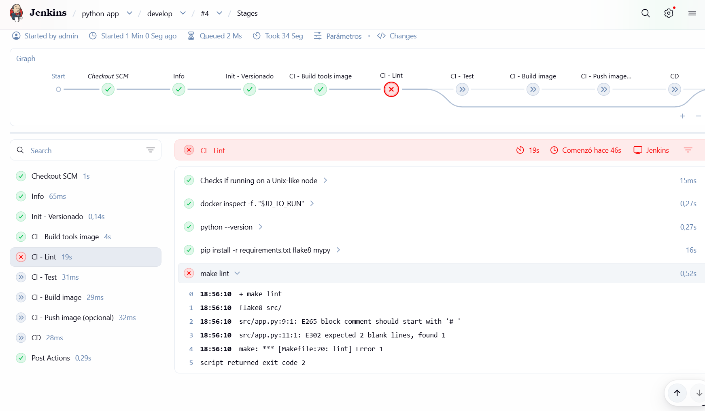

# DevOps Training - App Python

Repositorio de la aplicación Python usada en el curso para practicar estrategias DevOps de CI/CD en proyectos de lenguaje interpretado.

## Contexto del curso
- Herramientas: Jenkins (on-prem), GitHub/GitLab (SaaS) y Azure DevOps (plataforma cloud 360).
- La rama `feat/base` contiene el código mínimo para empezar y el enunciado de todas las prácticas.
- Cada práctica tiene su `.md` de enunciado en el repo de IaC (rama `feat/base`). La solución vive en la rama `training-x-title`.
- Este README se actualizará de forma incremental durante el curso.

## Repositorios y ramas
- App Python (base `feat/base`): https://github.com/contreras-adr/devops-training-python-app/tree/feat/base
- App Java (base `feat/base`): https://github.com/contreras-adr/devops-training-java-app/tree/feat/base
- IaC/DevOps (base `feat/base`): https://github.com/contreras-adr/devops-training-iac-devops/tree/feat/base

## Propósito del repositorio
- App Python simple con soporte de contenedores.
- Base para pipelines, tests y despliegues en distintos sistemas CI/CD.

## Casos prácticos (5)
Habrá cinco casos prácticos, cada uno con una única rama de solución `training-x-title`.
- training-1-jenkins-config (ONGOING)
- training-2-piplines-ci-cd-jenkins (PENDING)
- training-3-github-actions (PENDING)
- training-4-gitlab-ci-cd (PENDING)
- training-5-azure-devops-pipelines (PENDING)

## Guía de uso local

### Ejecutar la app con Docker
```bash
docker build -t my-app:0.0.1 -f devops/Dockerfile .
docker run -d --name app1 -p 8080:5000 my-app:0.0.1
docker exec -it app1 bash
docker stop app1
docker start app1
docker logs app1
```

### Ejecutar BBDD y app con Docker Compose
```bash
docker compose up -d
curl localhost:5001
```

### Ejecutar lint y tests manualmente con `docker run`
Desde la raiz del repo:

```bash
# 1) Construir imagen de CI (incluye make)
docker build -t python-ci-tools:local -f devops/ci.Dockerfile .

# Lint (flake8 + black + mypy)
docker run --rm -v "$PWD":/app -w /app python-ci-tools:local sh -lc \
  "pip install -r requirements.txt flake8 mypy && make lint"

# Reformat
docker run --rm -v "$PWD":/app -w /app python-ci-tools:local sh -lc \
  "pip install -r requirements.txt flake8 mypy && make reformat"

# Tests (incluye lint porque `make test` depende de `make lint`)
docker run --rm -v "$PWD":/app -w /app python-ci-tools:local sh -lc \
  "pip install -r requirements.txt flake8 mypy && make test"
```

### Si falla el stage `CI - Lint` en Jenkins (caso esperado la primera vez)
En Python es normal que falle al principio por `black --check` hasta formatear código.

Captura de referencia del error:



Flujo recomendado:

```bash
# 1) Crear rama de corrección
git switch -c fix/lint

# 2) Reproducir y corregir lint en local
docker run --rm -v "$PWD":/app -w /app python-ci-tools:local sh -lc \
  "pip install -r requirements.txt flake8 mypy && make reformat && make lint"

# 3) Subir cambios a la rama de fix
git add .
git commit -m "fix: aplicar reformat para pasar CI lint"
git push -u origin fix/lint

# 4) Abrir PR de fix/lint -> develop y mergear
# 5) Relanzar Jenkins sobre develop
```

Después del merge a `develop`, confirma que `CI - Lint` pasa en la rama objetivo.

### Limpiar entorno
```bash
docker compose down -v
```
